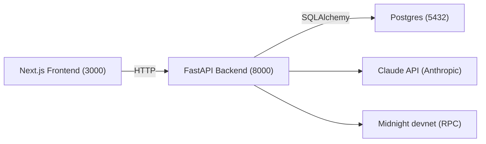

# VeriHire (Hackathon MVP)

Privacy-preserving hiring verification on Midnight: candidates prove qualifications without exposing raw personal data. Employers verify PASS/FAIL and view an AI trust report.

## Architecture (Phase 0)

- `frontend/` — Next.js 14 + Tailwind + TypeScript (App Router)
- `backend/` — FastAPI + SQLAlchemy + PostgreSQL
- `midnight/` — placeholder for Compact contract(s) + SDK scripts
- `shared/contracts/` — shared request/response contract notes/types (scaffold)



## Prereqs

- Node.js 18+
- Python 3.11+
- Docker + Docker Compose

## Quickstart (one command)

```bash
docker compose up --build
```

- Optional (recommended): `cp .env.example .env` and fill in secrets.
- Frontend: http://localhost:3000
- Backend health: http://localhost:8000/health
- Backend docs: http://localhost:8000/docs

## Environment Variables

Required (Phase 0 scaffolding uses placeholders):

- `ANTHROPIC_API_KEY` — Claude API key
- `MIDNIGHT_RPC_URL` — Midnight devnet RPC
- `MIDNIGHT_CONTRACT_ADDRESS` — deployed contract address (later)
- `DATABASE_URL` — `postgresql://verehire:verehire@db:5432/verehire`
- `JWT_SECRET` — generate with `openssl rand -hex 32`
- `NEXT_PUBLIC_API_URL` — backend base URL for frontend (`http://localhost:8000`)
- `MAX_RESUME_SIZE_MB` — upload limit (default `10`)

## API Skeleton (Phase 0)

Implemented as placeholders only (no business logic):

- `POST /auth/register`, `POST /auth/login`
- `POST /resume/upload`, `GET /resume/{id}/claims`
- `POST /proof/generate`, `POST /proof/verify`
- `POST /jobs`, `GET /jobs/{id}`, `POST /jobs/{id}/apply`
