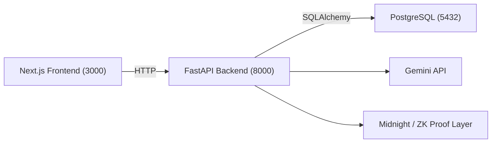

# VeriHire

Privacy-first hiring verification using zero-knowledge proofs.

## Problem

Hiring and onboarding workflows require candidates to share highly sensitive personal documents such as passports, visas, work authorization records, and resumes.

This creates major privacy and security risks:

- Exposure of personal identity data
- Risk of employer database breaches
- Unnecessary sharing of full documents
- Lack of user control over sensitive information

Candidates should be able to prove eligibility and qualifications without exposing their raw private data.

---

## Solution

VeriHire is a privacy-first hiring verification platform that allows candidates to prove qualifications and eligibility without revealing the underlying documents.

Using AI-powered claim extraction and zero-knowledge proof workflows, candidates can generate verifiable proofs from private credentials while employers only receive proof verification results.

This creates a trust-based hiring workflow with minimal disclosure.

---

## Core Features

- Candidate registration and authentication
- Employer registration and authentication
- Resume upload and parsing
- AI-powered extraction of claims (education, GPA, skills, certifications)
- Verifiable credential generation
- Zero-knowledge proof generation
- Employer proof verification
- Privacy-preserving hiring workflow
- Dockerized local development environment

---

## Tech Stack

### Frontend
- Next.js
- TypeScript
- Tailwind CSS

### Backend
- FastAPI
- Python
- SQLAlchemy
- PostgreSQL

### AI
- Google Gemini API

### Privacy / Cryptography
- Midnight ecosystem
- Zero-knowledge proof architecture

### DevOps
- Docker
- Docker Compose

---

## Architecture Overview

VeriHire follows a privacy-first verification workflow:

1. Candidate uploads a resume through the frontend
2. Backend processes the document
3. Gemini AI extracts structured claims
4. Claims are transformed into verifiable credentials
5. Zero-knowledge proofs are generated
6. Employer verifies proof without seeing sensitive documents



---

## Local Setup

### Clone Repository

```bash
git clone https://github.com/sanikasurose/midnight-hackathon.git
cd midnight-hackathon
```

### Start Application

```bash
docker compose up --build
```

### Application URLs

Frontend:
```text
http://localhost:3000
```

Backend API docs:
```text
http://localhost:8000/docs
```

---

## Environment Variables

Required environment variables:

```env
GEMINI_API_KEY=your_gemini_api_key
MIDNIGHT_RPC_URL=your_midnight_rpc_url
MIDNIGHT_CONTRACT_ADDRESS=your_contract_address
DATABASE_URL=postgresql://verihire:verihire@db:5432/verihire
JWT_SECRET=your_secret_key
NEXT_PUBLIC_API_URL=http://localhost:8000
MAX_RESUME_SIZE_MB=10
```

---

## Demo Flow

### Candidate Journey

**1. Register / Login**
- Candidate creates an account
- Authenticates securely

**2. Upload Resume**
- Upload PDF resume
- AI extracts:
  - Name
  - Degree
  - GPA
  - Skills
  - Certifications
  - Experience

**3. Generate Proof**
- Candidate selects a verifiable claim
- System generates privacy-preserving proof

---

### Employer Journey

**4. Verify Proof**
- Employer logs in
- Enters candidate proof ID
- System verifies proof instantly
- Employer receives verification result

No raw sensitive documents are exposed.

---

## Why It Matters

Traditional hiring requires oversharing.

VeriHire enables:

- Minimal disclosure
- Privacy-preserving verification
- Better candidate data ownership
- Reduced compliance risk
- Safer onboarding workflows

---

## Team

- Sanika Surose — Backend Lead
- Yves Sheja — Frontend Lead
- Umud Quliyev — DevOps / Integration / Demo Stability
- dc ablorh — Midnight / Zero-Knowledge Integration
- Prakhar Singh — AI Lead

---

## Hackathon Submission

Built for the Midnight Hackathon.

VeriHire demonstrates how zero-knowledge proofs can improve privacy in real-world hiring workflows.